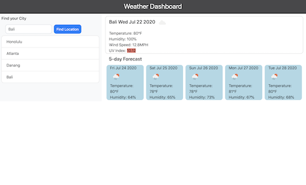

# Workday Planner Browser Application

## Application
Published on https://hngdngng.github.io/Weather-Dashboard/

## Description
The goal of this project was to create a simple weather application that allows traveling users to see the weather outlook for multiple cities. This app runs in the browser and feature dynamically updated HTML and CSS powered by jQuery.

## Languages
HTML5, CSS, Javascript (JQuery)

## Features
The website features the following:
* Verified weather data from OpenWeather API
* Current weather for any city
* 5-day forecast for any city
* UV index color indicators for favorable, moderate and  severe conditions
* Search history using local storage
* Dynamically updated HTML and CSS powered by JQuery
* Clean user interface
* Valid and correct HTML (using a validation service)

The following image demonstrates the application functionality:

## Author
Hoang Nguyen
